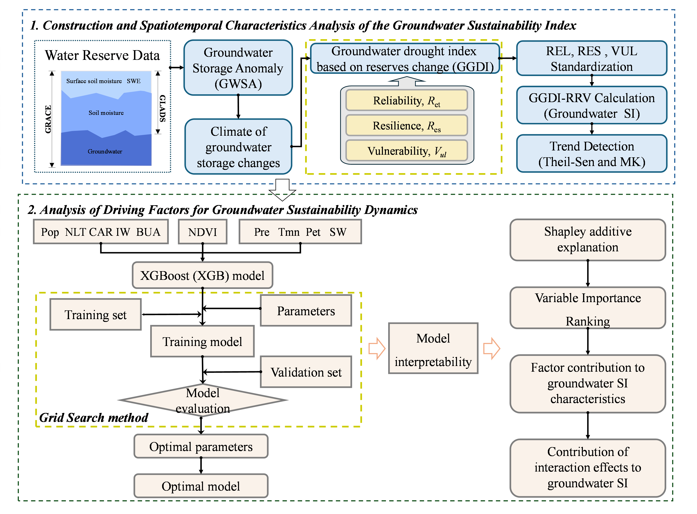

<h1 align="center">  An Interpretable Machine Learning Framework for Basin-Scale Groundwater Sustainability Assessment in China Using GRACE and Multi-Source Geospatial Data </h1>

## ✅ Groundwater Sustainability Mapping Product
You can retrieve our result data from `./data/`

---

## 📖 Abstract
This study develops an integrated framework to assess groundwater sustainability in China by combining hydroclimatic remote sensing data with interpretable machine learning. We compute annual Reliability (REL), Resilience (RES), Vulnerability (VUL), and a composite Sustainability Index (SI) from 2003 to 2023. Region-specific XGBoost models are trained for each major river basin, and SHAP (SHapley Additive exPlanations) is used to quantify feature importance and interactions among key drivers—such as precipitation, temperature, vegetation, surface water, and human activity proxies.

---

## 🛠️ Requirements
- python >= 3.10
- numpy >= 1.21
- pandas >= 1.4
- scikit-learn >= 1.2
- xgboost >= 1.7
- shap >= 0.40
- rasterio >= 1.3
- geopandas >= 0.12
- matplotlib >= 3.6
- tqdm >= 4.60
- scipy >= 1.9

---

## 🔍Raw Dataset
1. GRACE: http://www2.csr.utexas.edu/grace/RL06_mascons.html 
2. GLDAS: https://disk.gsfc.nasa.gov/datasets/GLDAS_NOAH025_M_2.1/summary?keywords=GLDAS
3. CRU TS: https://crudata.uea.ac.uk/cru/data/hrg/cru_ts_4.08/crucy.2407032054.v4.08/
4. NDVI: https://www.geodata.cn/data/datadetails.html?dataguid=239118756960240
5. Land Cover: https://www.ncdc.ac.cn/portal/metadata/9de270f3-b5ad-4e19-afc0-2531f3977f2f
6. LandScan: https://landscan.ornl.gov/
7. NPP-VIIRS: http://www.geodata.cn
8. Irrigated Cropland: https://s.ncdc.ac.cn/portal/metadata/098814d4-2b0b-46f9-9e27-1d6becf30868
9. Tndustrial Water Withdrawal: https://figshare.com/articles/dataset/The_China_industrial_water_withdrawal_Dataset_CIWW_a_gridded_monthly_industrial_water_withdrawal_data_in_China_from_1965_to_2020/21901074/1

---

## 🔥Usage
The workflow consists of two steps
### Download the preprocessed data
1. Our cases can be downloaded from [Baidu Netdisk](https://pan.baidu.com/s/1HNpEC9jm5W9ZO9lWoORTPQ)
2. Put the file in folder ./data/
